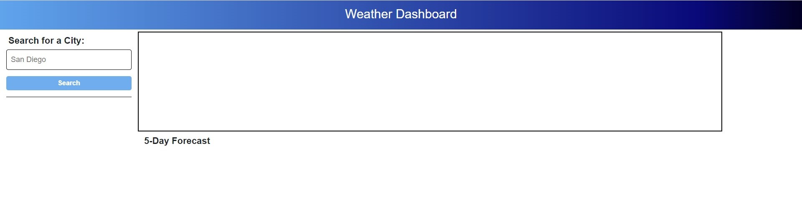
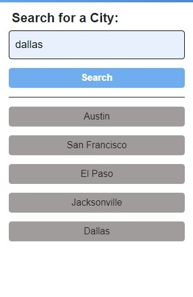

# Weather Dashboard

## Description

The weather dashboard application has been created for users to be able to search current weather by city, as well as, to view the forecast for the next 5 days. This application uses the OpenWeather API to retrieve weather data. The data displayed on the weather dashboard are the following.

    - City Name and Date;
    - Temperature;
    - Wind;
    - Humidity;
    - UV Index.

## Usage

Below screenshots of some of the features for reference.

- Weather dashboard user interface;

  

- When user enters a city, the result is displayed on the right side, with the forecast right below;

  

- A search history is displayed below the search button, where the user can click the city in the history and it will open the current weather, as well as, the forecast for that city.

  

- If the user doesn't enter a valid city an alert will show letting the user know that the city is not valid

## Questions

Please feel free to contact me if you have any questions or need any further information.

- [GitHub Profile](andybuzzi.github.com)

- [Email Address](andy@gmail.com)
